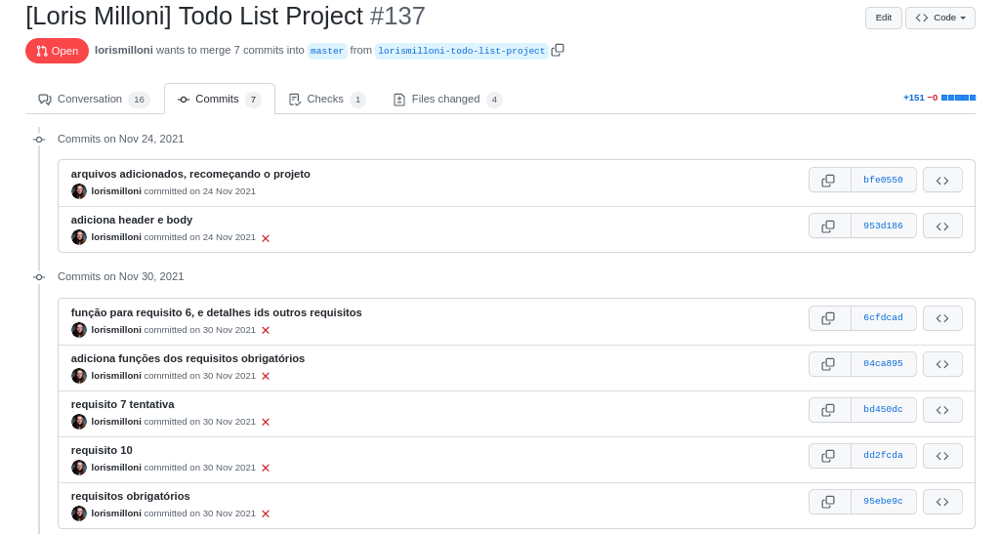
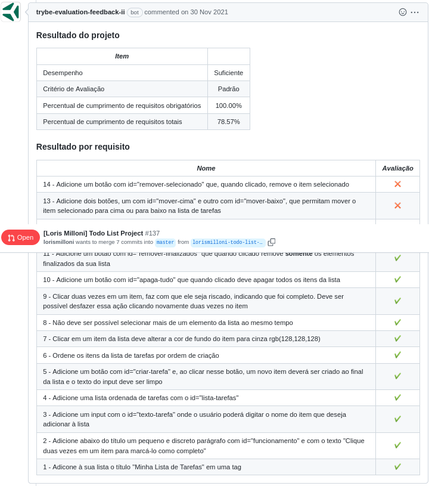

# study-project-todo-list
Made in **30/11/2021**.

## A very simples todo list created using JavaScript, HTML and CSS.
#### In this assignment I've learned how to manipulate CSS with JavaScript.
  
#### You can see my website in [this link](https://lorismilloni.github.io/study-project-todo-list/).

#### Trybe has a private repository with files that can't be shared. So here is my commit history print:

#### Here is the Trybe Evaluator

